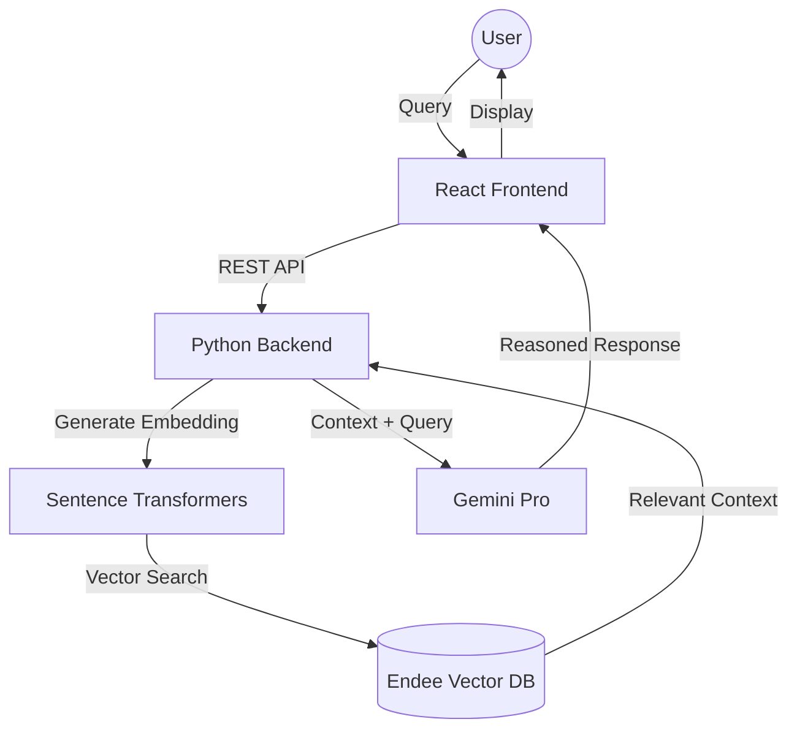

# 🚀 Agentic RAG AI: Vector Memory + Agentic Reasoning

Powered by **Endee** and **Gemini**, this system bridges the gap between static LLMs and persistent, context-aware intelligence.

[](#)
[](#)

## 📌 Overview

**Agentic RAG AI** is a full-stack AI system designed for long-term knowledge retention. Unlike traditional chatbots that forget the conversation as soon as the window is closed, this system uses **Endee** as a persistent semantic memory layer to retrieve, reason over, and synthesize information from past interactions.

---

## ✨ Key Features

* **🧠 Vector Memory (Endee):** High-performance storage for dense embeddings.
* **🔍 Agentic RAG Pipeline:** Intelligent retrieval that filters context before passing it to the LLM to reduce hallucinations.
* **🤖 Gemini Reasoning:** Multi-step cognitive processing powered by Google's Gemini models.
* **💎 Premium Frontend:** A sleek, "Glassmorphism" interface built with React and Tailwind CSS.
* **⚡ Real-time Updates:** Instant vector insertion and retrieval for seamless user experiences.

---

## 🏗️ Architecture & Data Flow


## 🛠️ Tech Stack
Layer,Technologies
Frontend,"React 18, Tailwind CSS, Lucide Icons, React Markdown"
Backend,"Python 3.10+, FastAPI / Flask"
LLM,Google Gemini API
Embeddings,Sentence Transformers (all-MiniLM-L6-v2)
Vector DB,Endee OSS (C++ optimized engine)

## 📂 Project Structure
```
agent-endee/
├── backend/
│   ├── agent.py        
│   ├── memory.py        
│   ├── retrieval.py    
│   ├── embeddings.py    
│   └── main.py          
├── frontend/
│   ├── src/
│   │   ├── components/  
│   │   ├── App.jsx     
│   │   └── index.css    
│   └── package.json
└── README.md
```

## ⚙️ Setup Instructions

### 1️⃣ Run Endee (Vector Database)
Ensure you have the Endee engine running locally:

Bash
#### Inside your Endee repository
```
./install.sh --release --avx2
./run.sh
```
```
Endee runs at: http://localhost:8080
```

### 2️⃣ Create Vector Index
Initialize the memory space for your agent:
```
Python
import requests

requests.post(
    "http://localhost:8080/api/v1/index/create",
    json={
        "index_name": "agent_memory",
        "dim": 384,
        "space_type": "cosine"
    }
)
```
### 3️⃣ Backend Setup
```
Bash
cd backend
pip install -r requirements.txt
export GEMINI_API_KEY=your_actual_api_key
python main.py
```
### 4️⃣ Frontend Setup
```
Bash
cd frontend
npm install
npm run dev
```

## 🧠 How it Works
### Memory Storage
When a user provides a statement:

Embed: The text is converted into a 384-dimensional vector.

Store: The vector is inserted into the Endee database with a unique ID.
### Query Handling
When a user asks a question:

Retrieve: The system performs a KNN similarity search in Endee to find the top $K$ most relevant past memories.

Augment: These memories are injected into the LLM prompt as "Knowledge Context."

Generate: Gemini processes the context and query to provide a grounded, intelligent response.

## 🛠️ Troubleshooting
Port Conflicts: Ensure 8080 (Endee), 5000 (Backend), and 5173 (Frontend) are free.

Index Missing: If the backend fails to search, ensure you ran the Index Creation script in Step 2.

API Key: Double-check that your GEMINI_API_KEY is active in the Google AI Studio.


